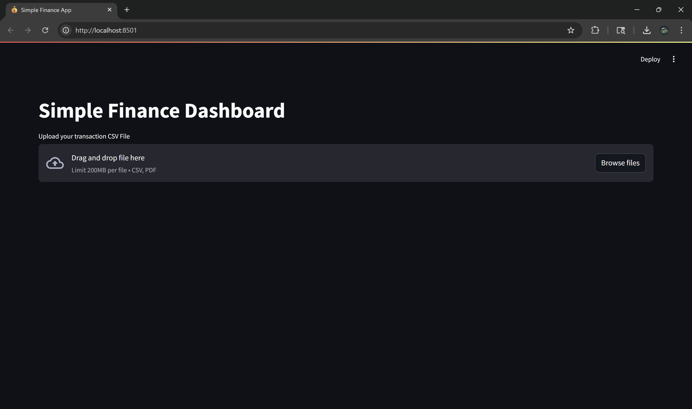

# Automate Finances With Python

Automate your personal finances effortlessly using Python! This project provides scripts to track, analyze, and visualize your financial data with minimal manual input.

---

## Features

- **Expense Tracking:** Automatically categorize and record expenses from bank statements.
- **Budget Analysis:** Set budgets and track actual spending against them.
- **Financial Visualizations:** Generate charts for spending patterns, savings goals, and more.
- **Custom Alerts:** Notifications for overspending or unusual transactions.
- **Multi-Account Support:** Manage multiple bank accounts in one place.

---

## Project Screenshots

### Upload Bank Statement



### Categorized Transactions Table


### Spending Visualization


---

## Installation

1. Clone the repo:

   ```bash
   git clone https://github.com/techwithtim/AutomateFinancesWithPython.git
   cd AutomateFinancesWithPython
